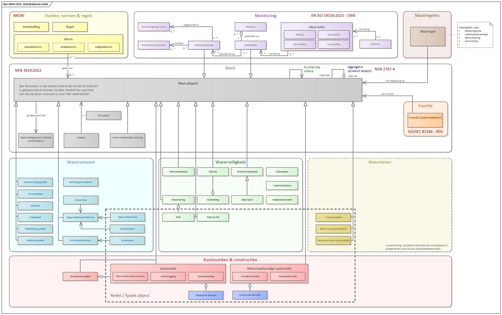

# Informatiemodel Water Basis

## Inleiding IMWA Basis

Het informatiemodel Water (IMWA) beschrijft alle relevante objecten, de onderlinge relaties en attributen van de Aquo-standaard. Omdat IMWA een omvangrijk model is, is het voor de overzichtelijkheid onderverdeeld in een paar onderdelen.

*Totaalplaat van IMWA in samenhang*

IMWA Basis bevat een deel van de objecttypen uit het conceptueel informatiemodel: 
- **Basis** (grijs) 
- **Kunstwerken** (rood) 
- **Watersysteem** (blauw) 
- **Waterveiligheid** (groen) 
- **Waterketen** (oker) 
- **Monitoring** (paars) 
- **Normen** (geel)

Deze worden gebruikt in de overzichtsplaat van het conceptueel informatiemodel (IM Water).
